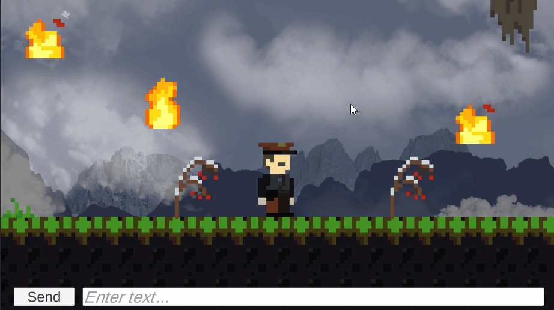

# Unity InputSystem Test

Unity Inputを使っていろいろやってみるプロジェクト

# requirements

* Unity 2021.3.3f1
* [Asset FTTGR](https://assetstore.unity.com/packages/2d/environments/asset-fttgr-222174)
* [DOTween](https://assetstore.unity.com/packages/tools/animation/dotween-hotween-v2-27676)

# [DemoPage](https://ayutaz.github.io/InputSystemTest)



# usage

1. Open Unity 2021.3.3f1 and select Project
2. import [Asset FTTGR](https://assetstore.unity.com/packages/2d/environments/asset-fttgr-222174)
3. import [DOTween](https://assetstore.unity.com/packages/tools/animation/dotween-hotween-v2-27676)
4. open Main Scene

# 試したこと

- [x] 特定のオブジェクトの移動
- [x] キーボード入力
- [x] UIボタンの入力
- [x] 特定オブジェクトのマウスクリック判定
- [x] ビルド後 ビルドデータを特定のブランチにpush(WebGL Deploy)

# Deploy.bat detail

```bat
git add *
git commit -m "Deploy"
git push origin webgl_build
```